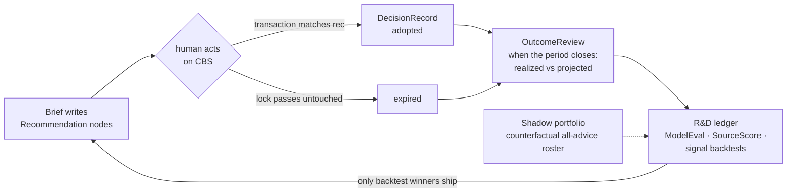

# fantasy-assistant

In-season strategic intelligence system for the Bob Uecker Imaginary Baseball
League (13-team CBS roto). Mission: **win the league.**

- [PROBLEM.md](PROBLEM.md) — problem statement, scope, valuation principles
- [SCHEMA.md](SCHEMA.md) — graph schema (events / snapshots / derived beliefs)
- [docs/ONTOLOGY.md](docs/ONTOLOGY.md) — deployed schema, auto-generated from the live DB
- [docs/adr/](docs/adr/) — architecture decision records

## The 30,000-foot view

Telemetry flows one way — sources → capture → graph → analytics → advisory —
and every recommendation flows back in as telemetry about our own judgment:

```mermaid
flowchart LR
    subgraph sources[Sources]
        CBS[CBS league site<br/>rosters · transactions · standings<br/>lineups · FA pool · RotoWire news]
        MLB[MLB Stats API<br/>game logs · per-pitch feeds<br/>transactions · probables]
        SAV[Baseball Savant<br/>xstats · bat speed<br/>sprint · chase]
    end

    subgraph capture[Capture — scouting agents]
        RUN[Playwright runner<br/>persisted CBS session]
        COLL[async collectors<br/>retries + isolation]
    end

    subgraph graph[Neo4j graph — single source of truth]
        EV[Immutable events<br/>transactions · draft picks · news]
        SNAP[Authoritative snapshots<br/>standings · rosters · lineups · pool]
        DER[Derived beliefs<br/>stints · signals · projections<br/>similarity · eligibility]
    end

    subgraph analytics[Analytics]
        REC[recompute<br/>98.1% exact vs CBS]
        RACE[races: projections<br/>+ marginal point curves]
        VAL[trade valuation<br/>both-sides portfolio math]
        MC[Monte Carlo sim<br/>correlated categories]
    end

    subgraph advisory[Advisory]
        BRIEF[weekly brief<br/>before Monday locks]
        ALERT[real-time alerts]
    end

    CBS --> RUN --> EV & SNAP
    MLB --> COLL --> EV & DER
    SAV --> COLL --> DER
    EV & SNAP --> REC --> RACE --> VAL & MC
    RACE --> BRIEF
    VAL & MC --> BRIEF
    DER --> BRIEF & ALERT
    BRIEF -- Recommendation nodes --> graph
```

### The three autonomous loops

```mermaid
flowchart TB
    subgraph daily[Daily routine — 07:07]
        D1[CBS snapshot] --> D2[MLB game logs] --> D3[ingest<br/>sanity gates: ~500+ txns, 0 rejects]
        D3 --> D4[replay reconcile<br/>derived state vs snapshots<br/>diffs = capture bugs, never absorbed]
        D4 --> D5[identity audit<br/>name-collision checks, report-only]
        D5 --> D6[outcomes + races +<br/>Sun/Mon brief] --> D7[commit]
    end

    subgraph bus[Event bus — every 3 min]
        B1[MLB transactions feed] --> B2{new event touching<br/>our player universe?}
        B2 -- yes --> B3[Alert node +<br/>macOS notification]
    end

    subgraph slow[Signal lane — every 30 min]
        S1[probables · velocity · CSW<br/>contact · heat · eligibility · news]
        S1 --> S2[Signal nodes<br/>FA-flagged] --> S3[republish ontology<br/>for the ask agent]
    end
```



### The advice loop — the system grades its own judgment

Models only ship after beating the incumbent in a backtest, and every
recommendation is pre-registered so outcomes can be scored against it:



## Layout

```
src/fantasy_assistant/
  capture/     # scouting agents: CBS league site, MLB Stats API, Savant, news
  graph/       # graph client, schema constraints, ingestion (idempotent upserts)
  analytics/   # projections blend, race analysis, valuations, standings sim
  advisory/    # weekly brief + daily alerts
data/raw/      # timestamped raw captures (see per-day MANIFEST.md)
tests/         # golden-file parser tests + math-core unit tests
docker-compose.yml  # Neo4j
```

## Running Neo4j

```bash
docker compose up -d neo4j
```

Browser at http://localhost:7474 (auth in `.env`, see `.env.example`).

## Status

Live (2026-08-02). Full-season graph loaded and reconciled against CBS
(replay 369/369, recompute 98.1% exact); three autonomous loops running
(daily 07:07 snapshot routine, 3-min MLB event bus, 30-min signal lane);
backtest-gated projections; weekly brief with pre-registered recommendations
scored against outcomes; local ops dashboard with NL→Cypher ask box at
http://127.0.0.1:8347. Deployed schema: [docs/ONTOLOGY.md](docs/ONTOLOGY.md).
Tests: `.venv/bin/python -m pytest tests/`.
